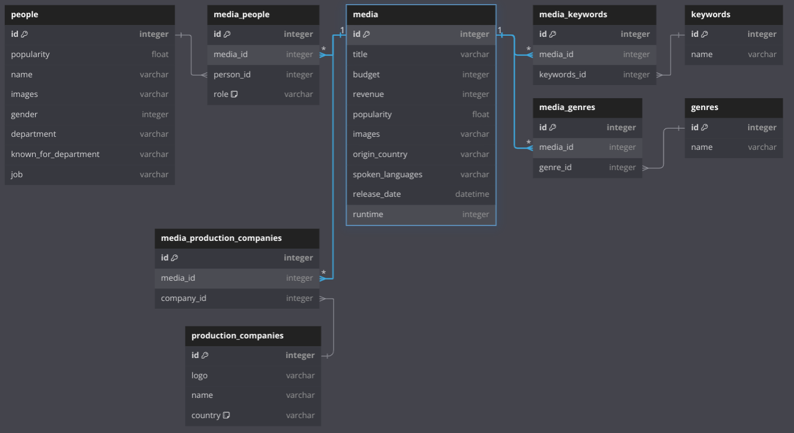

# Data analasys of The Movie Database
In this project I will use TMDB's API to do some basic dataanalasys. My plan is to analyse:
- What directors has directed the most movies/tv-shows
- What actors have been the most active
- What genres has been most popular each decade
And also a few other things I find would be interesting to know about.  

I am going to have the data i use saved as .json files, and plan on making graphs with matplot.lib or something similar near the end to visualise the data. 


This is also my first proper project, so there will most likely be a few mistakes, both when it comes to coding and coding practices. (And also potentially words used, like "Schema" etc. but this is indeed a learning journey.)

## Table of Contents
- [Data analasys of The Movie Database](#data-analasys-of-the-movie-database)
  - [Table of Contents](#table-of-contents)
  - [Installation](#installation)
  - [Database info](#database-info)
  - [Usage](#usage)
  - [License](#license)

## Installation
1. Clone the repository:
```bash
 git clone https://github.com/Jonathan-Funk-web/Dataanalyse-av-Filmdatabase/
```

2. Install dependencies:
```bash
 pip install requests dotenv
 ```

## Database info
So while this project is very much me figuring out how to do stuff like this, I figured out that I should use a DBR Schema (DataBase Relationship). So here is the Schema for the project:  (Was made with https://dbdiagram.io/. You can find the code for the schema in `DBRSchema.txt` (I was unsure about the file extension to use.))


## Usage
1. First Make a `.env` file with `MOVIEDB_APP_AUTH_DOMAIN=[YOUR API KEY FROM THE MOVIE DATABASE HERE]`
2. get the basic unfiltered data with running `get_data(url_get_movies)`

## License
This project is licensed under the [MIT License](LICENSE).


